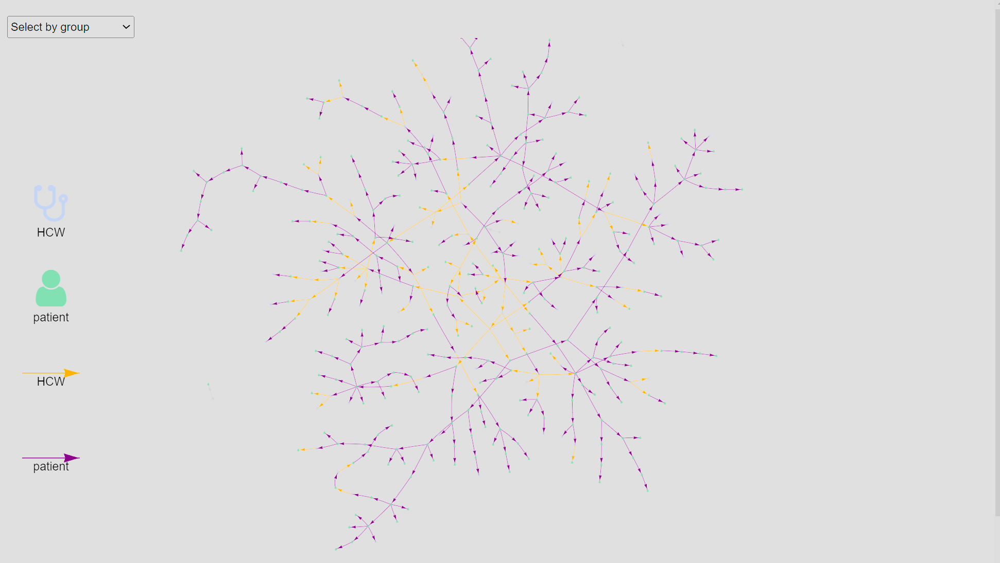

[](https://cran.r-project.org/package=o2groups)

# Overview

Effective outbreak control relies on a comprehensive understanding of how diseases spread between affected groups, such as healthcare workers and patients or specific age groups.

We developed an estimator that utilises information on transmission chains (who infected whom), enabling the identification and quantification of transmission patterns between groups (see package `linktree`)

The `o2groups` package provides a framework for simulating outbreaks using branching processes specifically designed for scenarios involving multiple groups with various transmission assortativity coefficients (`gamma`).

The package is still under development and is not yet available on CRAN.

```{r setup, include=FALSE}
#knitr::opts_chunk$set(echo = FALSE)
```

# Installation

```{r}
#devtools::install_github("CyGei/o2groups")
library(o2groups)
```

# The assortativity coefficient

By quantifying the extent to which individuals transmit infections within their own groups, assortativity coefficients offer a means to measure the relative contributions of different groups to transmission. $\gamma$ is defined as the excess probability of a secondary infection taking place within group a compared to random expectations. $\gamma$ values range from 0 (fully disassortative) to ∞ (fully assortative), with 1 indicating homogeneous patterns. For instance, $\gamma$ = 2 indicates that an infected individual from group a is twice as likely to infect an individual from the same group compared to an individual from another group. Conversely, a $\gamma$ of 1/2 means that an infected individual from group a is twice as likely to infect an individual from another group compared to an individual from the same group.

# Example

## Simulation

We first specify the input parameters for our simulation.

```{r}
set.seed(123)
duration = 100
group_n = 2
size = c(100, 400)
name = c("HCW", "patient")
gamma = c(2, 0.8)
intro_n = c(1, 3) 
r0 = c(1.7, 2) 
generation_time = c(0, 0.1, 0.2, 0.4, 0.2, 0.1, 0) 
incubation_period = sample(1:14, sum(size), replace = TRUE) 
```

We then run the outbreak simulation using the `simulate_groups` function.

```{r}
set.seed(123)
sim <- simulate_groups(
  duration = duration,
  group_n = group_n,
  size = size,
  name = name,
  gamma = gamma,
  intro_n = intro_n,
  r0 = r0,
  generation_time = generation_time,
  incubation_period = incubation_period
)
head(sim)
```

```{r}
library(epicontacts)
x <- make_epicontacts(linelist = sim[, c("id", "group", "date_onset")],
                      contacts = sim[, c("source_group","source", "id")],
                      id = "id",
                      from = "source",
                      to = "id",
                      directed = TRUE)

p = vis_epicontacts(
  x,
  node_color = "group",
  edge_color = "source_group",
  node_shape = "group",
  shapes = c(HCW = "stethoscope",
             patient = "user"),
  edge_col_pal = c(HCW = "orange",
                   patient = "purple"),
)

```


